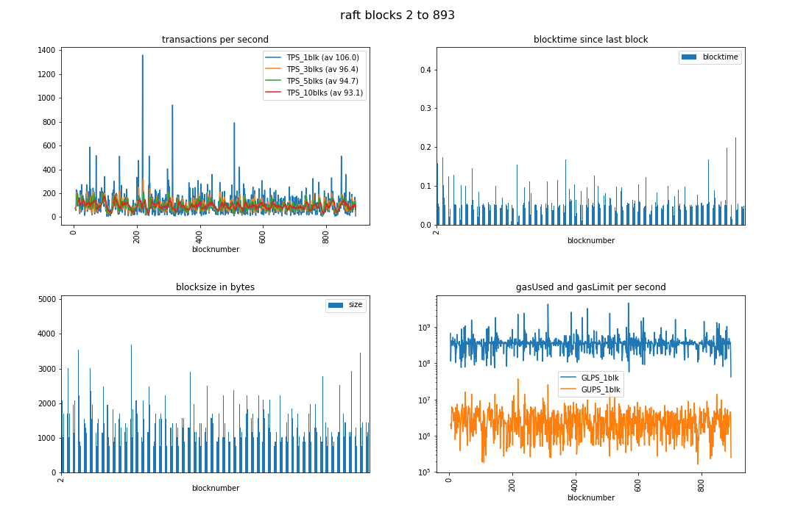

# blockbench

[](https://github.com/robinbryce/blockbench/actions/workflows/loadtest-each-consensus.yaml)

Tools to explore the performance characteristics of different etherum/quorum
private network deployments. Emphasis is given to fast creation and
re-configuration of different shaped networks. Read "bench" as in work/bench
rather than bench/mark.

Features

* Single command to create kustomize manifests for ibft, raft or rrr[^1] network.
* Single command to create docker-compose setup for ibft, raft or rrr[^1] network.
* Loadtesting tool with output to chainhammer compatible db format
* GitHub action automation example using kubernetes job to run in-cluster loadtest
* Single command graph generation & reports (markdown, jupytext,
  papermill).
  

  Axis labels are only visible in the github *light* theme.
* Selection of canned configurations for setting up ibft, raft or rrr[^1].
* VScode debugging of nodes in compose based networks (as remote via delve)
* Directly running geth/quorum nodes from sources (go run on volume mounted sources)
* Discovery enabled networks with bootnodes (rrr only for now, ibft and raft use static-nodes.json)

The jupyter charting support owes much to the
[chainhammer](https://github.com/drandreaskrueger/chainhammer/blob/master/README.md)
project, which also supports a broader range of ledgers.

[^1]: A pre-alpha implementation of this
  [paper](https://arxiv.org/pdf/1804.07391.pdf) for go-ethereum. Testing and
  development of which was a key motivation for this project.

# Quick example

Having completed [Setup](#Setup), these are the steps to deploy and load test a raft 5 node network

```bash

cd ~/workspace

bbench new -n 5 raft5 raft
cd raft5

docker-compose up -d
docker-compose logs -f node1
# watch the log for a bit to see that raft a peercount=4 in the logs

# Run the load generation tool (from source for now)
cd ../blockbench/go/bbencheth
go run main.go -e http://127.0.0.1:8300/  load -t 5 -a 3 --dbsource ~/workspace/raft5/raft5.db

cd ~/workspace/raft5
bbench jpycfg .
bbench jpyrender .
```

Then open standard-plots.html (it is self contained)

# Jupyter

```sh
# assumes `Quick example` (above)
cd ~/workspace/raft5
env/bin/jupyter notebook --ip=127.0.0.1
```

Follow the instructions in the log to access the environment in your browser

# k8s - raft

```sh
bbench new -k raftk8 raft
kustomize build raftk8/raft | kubectl apply -f -
```

# k8s - ibft

```sh
bbench new -k ibftk8 ibft
kustomize build ibftk8/ibft | kubectl apply -f -
```


# k8s - rrr
```sh
bbench new -k -p small rrrk8 rrr
kustomize build rrr30k/rrr | kubectl apply -f -
```


# Debug a node

```sh
cd ~/workspace/raft5
```

Open the docker-compose.yaml and find the stanza for node0

```yaml
node0:
  <<: *node-defaults
  working_dir: /nodes/node0
  ports:
    - "8300:8300"
```

Make it look like this

```yaml
node0:
  <<: *node-debug
  working_dir: /nodes/node0
  ports:
    - "8300:8300"
    - "2345:2345"
```

Edit the .env file (if necessary) and ensure that 
QUORUM_SRC refers to the location of your geth clone and DELVE_IMAGE has the
name of an approprate delve image. See the example [Dockerfile](./compose/delve-debug/Dockerfile-delve). If you want to use the example, then

```
cd ~/workspace/blockbench/compose/delv-debug
docker build . -f Dockerfile-delve -t geth-delve:latest
```

And set DELVE_IMAGE=`geth-delve:latest` in the `.env` file.

In a vscode workspace which includes quorum create a debug launch
configuration. The resulting launch.json should look like this:

```json
[
    {
        "name": "geth node docker remote",
        "type": "go",
        "request": "attach",
        "mode": "remote",
        "port": 2345,
        "host": "127.0.0.1",
        "remotePath": "/go/src/quorum",
        "cwd": "~/workspace/quorum",
        // "trace": "log"
    }
]
```
See this
[guide](https://github.com/golang/vscode-go/blob/master/docs/debugging.md) for detailed help re debugging go with vscode.


Start node0 on its own `docker-compose up node0`

Once it starts listening start the debug target in vscode.

Note: the cwd needs to be the quorum clone directory in order for source level break points to work.  If you placed
the quorum clone according to the Setup section, the defaults should be ok.

# Setup

## docker

We provide a docker image as an alternative to installing the tools described below. 

`docker run -u $(id -u):$(id -g) -v $(pwd):$(pwd) -w $(pwd) robinbryce/bbench`

Is equivelant to installing all the host tools and running

`tusk -qf blockbench/tusk.yml`

## Host (linux)

Note: See the [Dockerfile](./Dockerfile) for full details

Python >= 3.8 and docker (with docker-compose) is assumed. Currently, a go ~1.15
development setup is required to run the load generation tool. If there is any
interest, binary releases will be provided.

Convenience install script for linux amd64 (also fine for wsl2)
```sh
echo "Installing for linux_amd64"
mkdir ~/workspace && cd ~/workspace

# Install yq (jq for yaml)
YQ_VERSION=v4.12.0

# NOTICE: change this if not on linux x86_64
YQ_BINARY=yq_linux_amd64

wget https://github.com/mikefarah/yq/releases/download/${YQ_VERSION}/${YQ_BINARY}.tar.gz -O - |\
  tar xz && mv ${YQ_BINARY} ~/.local/bin/yq

# To take advantage of vscode remote debug (to docker-compose node) support
# higher versions should work fine. 2.6.0 is the earliest expected to work (due
# to reliance on dns resolution feature)
git clone https://github.com/ConsenSys/quorum.git
$(cd quorum && git checkout v21.4.1)

# Install go-task and alias the main entry point
curl -sL https://git.io/tusk | bash -s -- -b ~/.local/bin latest

git clone https://github.com/robinbryce/blockbench.git
alias bbench='tusk -qf ~/workspace/blockbench/tusk.yml'
```

Please see [go-tusk](https://github.com/rliebz/tusk#readme), [yq](https://github.com/mikefarah/yq/blob/master/README.md) for up to installation details and information for other platforms.

The [go-quorum](https://github.com/ConsenSys/quorum.git) clone clone is needed to take advantage of  compose remote debug  configuration [^2], but otherwise can be ommitted

# Smoke test all supported consensus methods

`for cc in raft ibft rrr; do bbench new ${cc}default ${cc}; done` Then cd into
each of raftdefault, ibftdefault and rrrdefault in turn and do `docker-compose
up`

Ctrl-C (and possibly docker-compose down) to clean up between each run

